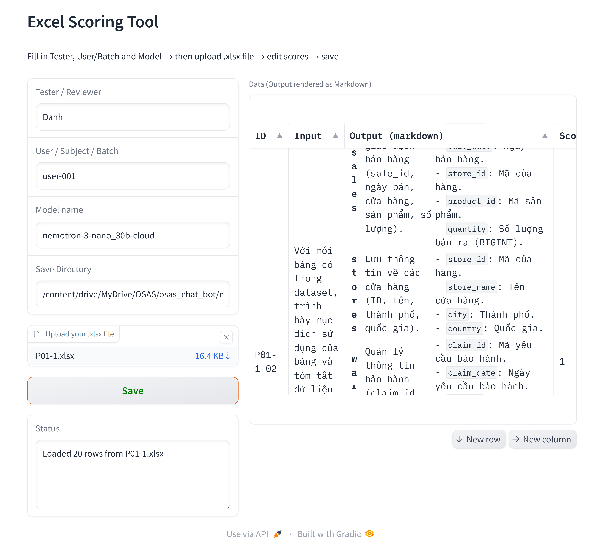

# manual_evaluation

## Demo


## Getting Started

### Clone app
```bash
git clonehttps://github.com/danhtran8989/manual_evaluation.git
```

### Install dependencies
```bash
pip install -r requirements.txt --force-reinstall
```
### Start App
```python
python app.py
```
App willbe hosted at: `localhost:7860`
